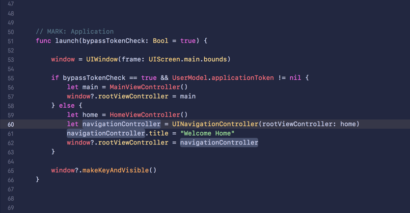
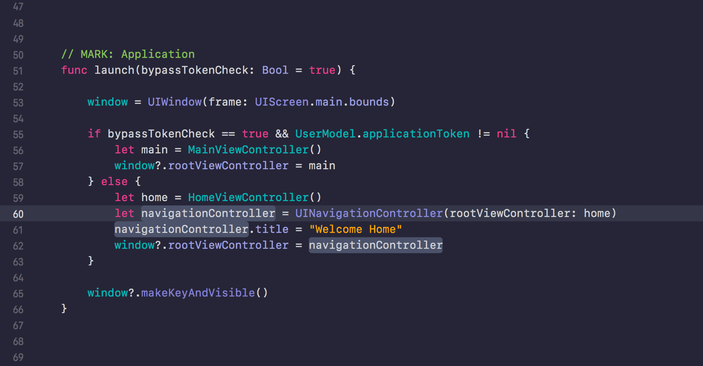

Your code doesn't have to look so sour. I've collected a list of Xcode themes (and fonts) a while ago. Many more themes have been submitted in the meanwhile so if you have a theme you'd like to add to the list, just let me know!

## Xcode Themes

> 👨🏻‍💻 Personal themes for [Xcode](http://developer.apple.com/xcode).

### Tokyo

### Aqua

## Installation
1. Copy the theme(s) to the Xcode's `FontAndColorThemes` folder (`~/Library/Developer/Xcode/UserData/FontAndColorThemes/`).
2. Restart Xcode.
3. Go to `Xcode > Preferences > Fonts & Colors`.
4. Select your favorite theme.

## License

This project is available under the [MIT](http://opensource.org/licenses/MIT) license. See the LICENSE file for more info.

